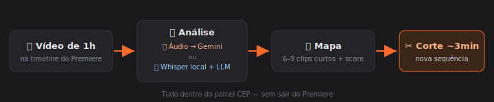
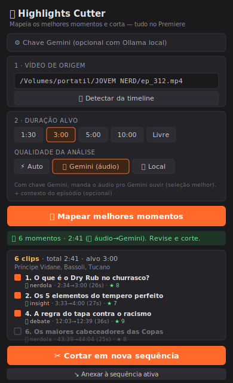

# 🎬 Highlights Cutter

Transforma um episódio longo (1h+) num corte de highlights de ~3 minutos **direto no Premiere Pro**. Você deixa o vídeo na timeline, o painel **mapeia os melhores momentos** com IA (o Gemini *ouvindo* o áudio, ou Whisper local + LLM) e **monta o corte** numa sequência nova — sem sair do Premiere.

<p align="center">
  
</p>

---

## ✨ O que ele faz

- **Detecta** o vídeo automaticamente da sua timeline (1º clip da V1).
- **Mapeia** 6–9 momentos fortes e curtos (humor, debate, nerdola, reação, momento, insight), com **score** e na ordem narrativa ideal.
- Respeita a **duração alvo** que você escolhe (1:30 / 3:00 / 5:00 / 10:00 / livre) — com trava de orçamento pra não estourar o tempo.
- **Monta o corte** numa sequência nova (sem mexer na sua timeline original) e adiciona **marcadores** por clip.

Dois modos de análise:
- **🎧 Áudio → Gemini** — renderiza o áudio comprimido (<20 MB) e manda pro Gemini *ouvir* (tom, timing, risada → seleção melhor). Precisa de uma chave Gemini grátis.
- **📝 Local (Whisper)** — transcreve offline com Whisper e escolhe via LLM local (Ollama). Timestamps mais precisos, funciona sem internet.
- **⚡ Auto** — usa o Gemini se houver chave, senão cai pro local.

<p align="center">
  
</p>

---

## 📦 Pré-requisitos

- **macOS** + **Adobe Premiere Pro 2022 ou mais novo**
- **[Homebrew](https://brew.sh)** (gerenciador de pacotes do Mac)
- **Python 3** e **ffmpeg**:
  ```bash
  brew install python ffmpeg
  ```
- **Opcional (modo local / offline):** [Ollama](https://ollama.com)
  ```bash
  brew install ollama
  ollama pull qwen2.5:7b
  ```
- **Opcional (modo áudio→Gemini):** uma chave grátis em [aistudio.google.com/app/apikey](https://aistudio.google.com/app/apikey)

> ⚠️ A 1ª transcrição com Whisper baixa um modelo (~145 MB) e demora um pouco num vídeo de 1h. As próximas usam cache.

---

## 🚀 Instalação

```bash
# 1. Clone o projeto
git clone https://github.com/carabugado/highlights-cutter.git
cd highlights-cutter

# 2. Cria o ambiente Python e instala as dependências do backend
./install_mac.sh

# 3. Instala o painel Highlights Cutter no Premiere
./install_highlights_mac.sh
```

Isso também liga o **modo debug do CEP** (necessário pra extensão não-assinada carregar).

Depois, **reinicie o Premiere**.

---

## ▶️ Como usar

1. **Ligue o backend** (deixe esta janela de Terminal aberta enquanto usa o Premiere):
   ```bash
   ./start_server.sh
   ```
   Sobe em `http://127.0.0.1:7821`.

2. No Premiere, com o **vídeo de 1h na timeline**, abra o painel:
   **Janela → Extensões → Highlights Cutter**

3. (Opcional, modo áudio) clique em **⚙ Chave Gemini**, cole a chave e salve.

4. Confira a **origem** (detectada da timeline) → escolha a **duração** e os **tipos** → **🔍 Mapear melhores momentos**.

5. Revise os clips (pode desligar os que não quiser) → **✂️ Cortar em nova sequência**.

Pronto: uma sequência nova com o corte montado e marcadores em cada clip.

---

## 🛠️ Ferramenta extra: transcrição via terminal

Gera um `.srt` de qualquer vídeo/áudio com o Whisper local:

```bash
./transcribe_video.sh "/caminho/do/episodio.mp4"
# salva o .srt ao lado do vídeo
```

---

## 🩺 Solução de problemas

| Sintoma | O que fazer |
|---|---|
| Painel diz **"backend offline"** | Rode `./start_server.sh` e deixe aberto. |
| **"Erro ao mapear: Not Found"** | O servidor está numa versão antiga — pare (Ctrl+C) e rode `./start_server.sh` de novo. |
| Painel **não aparece** no menu Extensões | Rode `./install_highlights_mac.sh` e **reinicie o Premiere**. |
| **Sem chave Gemini** | Use o modo **📝 Local** com o Ollama rodando (`ollama serve`). |
| Modo áudio **falha/limite (429)** | A chave bateu a cota — use outra chave, ou o modo **📝 Local**. |
| Cortes no **tempo errado** | No modo 🎧 áudio os timestamps são estimados de ouvido; use **📝 Local** (Whisper) pra tempo cravado. |

> Diagnóstico: o backend loga cada etapa no terminal do `start_server.sh` (qual engine, tamanho do áudio, resgate de resposta etc.).

---

## 🗂️ Estrutura

```
backend/                 # servidor FastAPI (porta 7821)
  highlights.py          # mapeamento dos melhores momentos (áudio/Gemini ou transcrição)
  transcribe.py          # Whisper local (+ CLI de SRT)
  llm.py                 # IA: Ollama local → Gemini → Anthropic
  server.py              # rotas (inclui /highlights)
cep-highlights/          # painel CEP "Highlights Cutter" do Premiere
install_highlights_mac.sh
install_mac.sh
start_server.sh
transcribe_video.sh
```

> ℹ️ Este repositório também inclui o **VSL B-Roll Generator** (painel `cep/` + módulos `broll_*` no backend), que **compartilha o mesmo backend** do Highlights Cutter. Por isso o backend é único.
