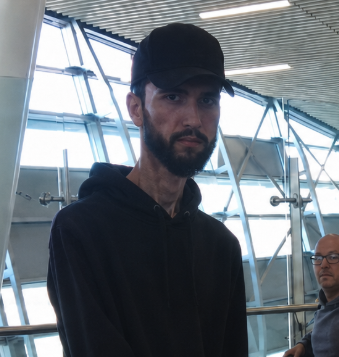

# 🎬 VSL Director — B-Roll Generator para Premiere Pro

> Painel CEP que transcreve sua VSL, escolhe B-rolls automaticamente com IA, gera prompts UGC e insere tudo na timeline do Premiere Pro.

<p align="center">
  
</p>

---

## ✨ O que faz

| Funcionalidade | Detalhe |
|---|---|
| **Transcrição automática** | Whisper local — detecta idioma, segmenta por frase |
| **Busca semântica de B-roll** | CLIP + score de nome de arquivo — sem precisar taguear nada |
| **Copymerda** | Alter ego IA que gera prompts UGC curtos (máx 15 palavras, inglês) para cada segmento, via Gemini |
| **VSL Director** | Analisa o arco narrativo completo da VSL e sugere o melhor B-roll por segmento, via Claude |
| **Geração de vídeo** | Botão por segmento para gerar clip de 7s via Higgsfield CLI |
| **Inserção em lote** | Aprova tudo e insere na timeline V2 de uma vez, em lotes de 10 |
| **Compliance** | Bloqueia imagens proibidas (cigarro, armas, conteúdo sensível) |
| **Ritmo** | Ajusta cortes para bater com os picos de energia da narração |

---

## 🖼️ Interface

O painel fica dentro do Premiere Pro em **Janela → Extensões → VSL B-Roll Generator**.

- Configurações: pasta de B-rolls, chaves de API, modelo de IA
- Campo de vídeo com detecção automática da timeline
- Botão **Processar VSL** — roda toda a pipeline
- Cards por segmento: texto / B-roll sugerido / prompt Copymerda / botão gerar vídeo
- Barra inferior: Desfazer / Aprovar todos e inserir / Inserir selecionados

---

## 📦 Requisitos

### Todos os sistemas
- **Adobe Premiere Pro** 2022+ (com suporte a CEP)
- **Python 3.10+**
- **ffmpeg** (para extração de áudio)
- Opcional: **Ollama** (LLM local gratuito)
- Opcional: chave **Gemini** (gratuita) para o Copymerda
- Opcional: chave **Anthropic** para o VSL Director

---

## 🍎 Instalação — macOS

### 1. Clone o repositório
```bash
git clone https://github.com/carabugado/gerador-de-vsl-bugadovisk.git
cd gerador-de-vsl-bugadovisk
```

### 2. Rode o instalador
```bash
chmod +x install_mac.sh
./install_mac.sh
```

O instalador:
- Habilita extensões CEP não assinadas no Premiere (modo debug)
- Copia o painel para `~/Library/Application Support/Adobe/CEP/extensions/`
- Cria o ambiente Python em `backend/.venv` e instala as dependências

### 3. Instale o ffmpeg (se não tiver)
```bash
brew install ffmpeg
```

### 4. (Opcional) Instale o Ollama para rodar IA local grátis
```bash
brew install ollama
ollama pull qwen2.5:7b
```

### 5. Inicie o servidor
```bash
./start_server.sh
```

### 6. Abra o Premiere
**Janela → Extensões → VSL B-Roll Generator**

---

## 🪟 Instalação — Windows

### 1. Pré-requisitos
- Instale o [Python 3.11](https://www.python.org/downloads/) — marque **"Add to PATH"** durante a instalação
- Instale o [ffmpeg](https://ffmpeg.org/download.html) e adicione ao PATH
  *(ou via winget: `winget install ffmpeg`)*
- Instale o [Git](https://git-scm.com/download/win)

### 2. Clone o repositório
```powershell
git clone https://github.com/carabugado/gerador-de-vsl-bugadovisk.git
cd gerador-de-vsl-bugadovisk
```

### 3. Habilite extensões CEP no Premiere
Abra o **Prompt de Comando como Administrador** e rode:

```powershell
reg add "HKCU\Software\Adobe\CSXS.12" /v PlayerDebugMode /t REG_SZ /d 1 /f
reg add "HKCU\Software\Adobe\CSXS.11" /v PlayerDebugMode /t REG_SZ /d 1 /f
```

### 4. Instale a extensão CEP manualmente
Copie a pasta `cep\` para:
```
C:\Users\<seu-usuario>\AppData\Roaming\Adobe\CEP\extensions\com.vsl.brollgenerator\
```

### 5. Crie o ambiente Python e instale as dependências
```powershell
cd backend
python -m venv .venv
.venv\Scripts\activate
pip install -r requirements.txt
```

### 6. (Opcional) Instale o Ollama
Baixe em [ollama.ai](https://ollama.ai) e depois:
```powershell
ollama pull qwen2.5:7b
```

### 7. Inicie o servidor
```powershell
cd backend
.venv\Scripts\activate
python server.py
```

Deixe essa janela aberta enquanto usa o Premiere.

### 8. Abra o Premiere
**Window → Extensions → VSL B-Roll Generator**

> **Nota Windows:** se o Premiere não mostrar a extensão, reinicie-o após instalar.

---

## ⚙️ Configuração inicial

No painel, clique no ⚙ (canto superior direito) para configurar:

| Campo | O que colocar |
|---|---|
| **Pasta de B-rolls** | Caminho da sua pasta com os vídeos de apoio |
| **Gemini API Key** | Chave grátis em [aistudio.google.com](https://aistudio.google.com) — para o Copymerda |
| **Anthropic API Key** | Opcional — para análise de arco narrativo (VSL Director) |
| **Pasta para clips gerados** | Onde salvar vídeos gerados pelo Higgsfield |
| **Modelo IA** | Ollama (local/grátis), Gemini ou Anthropic |

---

## 🚀 Uso

1. Abra sua VSL no Premiere e coloque o vídeo na timeline
2. No painel, clique **Detectar** para pegar o caminho do vídeo automaticamente
3. Clique **Processar VSL**
4. Aguarde: o sistema transcreve → analisa → indexa B-rolls → gera prompts
5. Revise os cards por segmento e ajuste se quiser
6. Clique **✓ Aprovar todos e inserir** para inserir tudo na timeline V2

---

## 🏗️ Arquitetura

```
gerador-de-vsl-bugadovisk/
├── backend/            # Servidor FastAPI (porta 7821)
│   ├── server.py       # Endpoints principais
│   ├── transcribe.py   # Whisper — transcrição e segmentação
│   ├── matcher.py      # CLIP semântico — match B-roll × segmento
│   ├── broll_search.py # Busca por embeddings + tags
│   ├── llm.py          # Roteador de LLMs (Ollama / Gemini / Claude)
│   ├── copymerda.py    # Gerador de prompts UGC (Copymerda)
│   ├── compliance.py   # Filtro de conteúdo proibido
│   ├── rhythm.py       # Ajuste de ritmo de corte
│   └── requirements.txt
├── cep/                # Painel Premiere Pro (HTML/JS/ExtendScript)
│   ├── index.html      # UI do painel
│   ├── js/main.js      # Lógica do painel
│   ├── jsx/host.jsx    # ExtendScript — controla a timeline
│   └── CSXS/manifest.xml
├── cep-translate/      # Painel auxiliar de tradução de SRT
├── install_mac.sh      # Instalador macOS
├── install_translate_mac.sh
└── start_server.sh     # Inicia o servidor Python
```

---

## 🤝 Contribuindo

Pull requests são bem-vindos. Para mudanças grandes, abra uma issue primeiro.

---

## 📄 Licença

MIT
